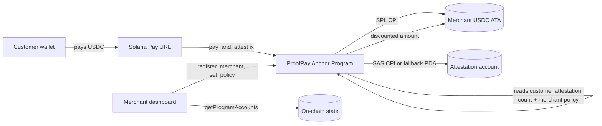

# ProofPay

**Portable cross-merchant customer reputation on Solana.**

Pay any Solana merchant in USDC. Earn a portable on-chain attestation. Get an auto-applied discount at the next merchant that trusts your history. No per-brand loyalty accounts.

Built for the [Solana Frontier Hackathon 2026](https://www.colosseum.com/frontier) (submission deadline **2026-05-11**).

- **Devnet program:** [`ABSmAN3fhCdnEnAdRiKUWjpBwrZb2FZ41EYD3hnFN5xT`](https://explorer.solana.com/address/ABSmAN3fhCdnEnAdRiKUWjpBwrZb2FZ41EYD3hnFN5xT?cluster=devnet)
- **IDL spec:** Anchor 0.30.1 (committed at [`proof-pay-app/src/lib/proof_pay.json`](./proof-pay-app/src/lib/proof_pay.json))

---

## Why this exists

> *"Enforce the relationship in code, not in a loyalty database."*

Every Solana commerce stack today gives each merchant its own siloed loyalty token — Decal, for instance, won $20k at Breakout 2025 with exactly this per-merchant model. The user's history stays inside that merchant's app.

ProofPay flips it: your purchase history is **yours**, living on-chain as a portable attestation the customer owns. Any future merchant can read it, apply their own discount policy, and price accordingly — with zero integration between merchants.

See [docs/wedge-shortlist.md](./docs/wedge-shortlist.md) for the full evidence appendix and why this wedge is unoccupied in the Colosseum winner corpus.

## Architecture



**One Anchor program + one Next.js app + Solana Attestation Service (with internal PDA fallback).** Devnet-first; mainnet in v2.

## Repository layout

```
proof-pay/                    # Anchor workspace (Rust program + LiteSVM tests)
  programs/proof_pay/src/
    lib.rs
    state.rs                  # MerchantRegistry, ProofPayAttestation, CustomerCounter, PolicyRule
    error.rs
    attestation.rs            # internal-PDA writer + USE_SAS_CPI feature flag
    instructions/
      register_merchant.rs
      set_policy.rs
      pay_and_attest.rs
      close_merchant.rs
  tests/                      # LiteSVM harness — happy path, discount, portability
  Anchor.toml, Cargo.toml, rust-toolchain.toml

proof-pay-app/                # Next.js 14 App Router frontend
  src/
    app/
      page.tsx                # landing
      merchant/page.tsx       # merchant dashboard (onboard, policy, tx list)
      checkout/page.tsx       # customer checkout (pay, trust score, receipt)
      api/solana-pay/         # Solana Pay transaction-request endpoint
    components/proofpay/      # nav, onboard, policy editor, tx list, trust score, receipt
    components/ui/            # Button, Input (shadcn-style)
    lib/
      anchor.ts               # useProofPayProgram() hook
      proof_pay.json          # committed IDL (Anchor 0.30 spec)
      pda.ts                  # registry / counter / attestation PDA derivation
      config.ts               # PROGRAM_ID, USDC_MINT, RPC_URL (env-overridable)
      format.ts               # USDC + bps formatters

docs/
  wedge-shortlist.md          # why ProofPay, with winner evidence
  mvp-spec.md                 # product stories, scope, demo script
  prize-lane.md               # Frontier 2026 lane decision (Grand Champion primary)
  competitive-landscape.md    # Decal, Humanship, ASSAP, Squads, Zebec
  skills-map.md               # solo-builder time + gap analysis
  demo-script.md              # 3-minute video shot list
  submission-checklist.md     # what to attach to the Colosseum form
  v2.md                       # out-of-scope backlog (frozen after May 1)

.github/workflows/ci.yml      # anchor build + litesvm + next lint
```

## Quickstart (devnet)

**Prereqs**

- Rust **1.86+** (the codebase uses crates that require `edition2024` — older toolchains won't build)
- Solana CLI 1.18+ with a funded devnet keypair at `~/.config/solana/id.json`
- Anchor 0.30.1 (`avm install 0.30.1 && avm use 0.30.1`)
- Node 20+ and npm

```bash
# 1. (Optional) build + test the Anchor program. The committed IDL already matches
#    the deployed binary, so you can skip straight to step 3 if you only want to
#    run the dapp against the live devnet program.
cd proof-pay
anchor build
cargo test --manifest-path tests/Cargo.toml

# 2. (Optional) deploy your own copy. If you do, run `anchor keys sync`, copy the
#    new program ID into proof-pay-app/.env.local, and re-publish the IDL on-chain.
solana airdrop 2
anchor deploy --provider.cluster devnet
anchor idl init --filepath ../proof-pay-app/src/lib/proof_pay.json \
  --provider.cluster devnet $(solana address -k target/deploy/proof_pay-keypair.json)

# 3. Run the frontend against the existing devnet deployment.
cd ../proof-pay-app
cp .env.example .env.local        # only edit if you re-deployed in step 2
npm install
npm run dev

# 4. Open http://localhost:3000
#    a) /merchant — connect a fresh Phantom wallet, register, set a policy
#    b) /checkout?merchant=<merchantAuthorityPubkey>&amount=10
```

### Environment variables

`proof-pay-app/.env.local`:

```
NEXT_PUBLIC_PROOFPAY_PROGRAM_ID=ABSmAN3fhCdnEnAdRiKUWjpBwrZb2FZ41EYD3hnFN5xT
NEXT_PUBLIC_USDC_MINT=Gh9ZwEmdLJ8DscKNTkTqPbNwLNNBjuSzaG9Vp2KGtKJr
NEXT_PUBLIC_SOLANA_RPC_URL=https://api.devnet.solana.com
```

The defaults in `src/lib/config.ts` already point at the live devnet program, so the file is only required if you change anything.

## The on-chain program in 200 words

One instruction per user-visible action:

1. **`register_merchant(name)`** — creates a `MerchantRegistry` PDA seeded by the merchant's wallet. Pins the USDC mint and treasury ATA at registration time so `pay_and_attest` can't be tricked into routing a different token.
2. **`set_policy(rules)`** — merchant-only (`has_one = authority`). Stores up to three `PolicyRule` entries: `{min_attestations, discount_bps, valid_until}`.
3. **`pay_and_attest(amount_usdc)`** — atomic:
   - Reads the customer's running attestation count from a `CustomerCounter` PDA (init-if-needed so first-time customers don't need a separate opt-in).
   - Evaluates the merchant's policy → best-matching `discount_bps` (caps at 9000 bps = 90% off).
   - SPL CPI transfers `amount_usdc - discount` from customer ATA → merchant treasury.
   - Writes a `ProofPayAttestation` PDA seeded by `(customer, registry, counter)` and bumps the counter.
4. **`close_merchant()`** — optional cleanup; refunds rent.

The `attestation::USE_SAS_CPI` flag switches the attestation path from the internal PDA to a CPI into the Solana Attestation Service (`sas-lib`). Internal PDA is the MVP default. See [docs/mvp-spec.md](./docs/mvp-spec.md) for the SAS integration plan.

## Frontend ↔ program wiring

| UI surface | Program method | Source |
|---|---|---|
| `/merchant` → "Register merchant" | `register_merchant(name)` | [`onboard-panel.tsx`](./proof-pay-app/src/components/proofpay/onboard-panel.tsx) |
| `/merchant` → "Save policy" | `set_policy(rules)` | [`policy-editor.tsx`](./proof-pay-app/src/components/proofpay/policy-editor.tsx) |
| `/checkout` → "Pay & earn attestation" | `pay_and_attest(amount_usdc)` | [`checkout/page.tsx`](./proof-pay-app/src/app/checkout/page.tsx) |
| Trust score & dynamic discount preview | `program.account.customerCounter.fetch` + `program.account.merchantRegistry.fetch` | same files |

The Anchor client is created lazily once a wallet is connected — see [`useProofPayProgram()`](./proof-pay-app/src/lib/anchor.ts).

## Testing

Three LiteSVM tests cover the full flow in-process (no test validator needed):

- `happy_path_register_and_single_payment` — registration + one purchase.
- `discount_applies_after_threshold` — policy with `min_attestations = 2` kicks in on purchase #3.
- `portable_reputation_across_two_merchants` — attestations from merchant A discount the first-ever purchase at merchant B. **This is the hero test; it's the actual product promise in a unit test.**

Run them with `cargo test --manifest-path tests/Cargo.toml`.

## What's different from Decal, Humanship, ASSAP, Squads

See [docs/competitive-landscape.md](./docs/competitive-landscape.md). One-sentence answer: **Decal gives each merchant a siloed loyalty token; ProofPay gives the customer a portable reputation that every Solana merchant can choose to honor.**

## Demo script (≈ 3 min)

Reproduced in [docs/demo-script.md](./docs/demo-script.md). Beats in order:

1. Flash the README on-screen.
2. Merchant A onboards (Phantom → name → policy "≥3 → 10% off").
3. Customer pays 4.50 USDC at Merchant A. Attestation mints. Trust score = 1.
4. Merchant B onboards (second wallet → "≥3 → 15% off").
5. Customer pays twice more at Merchant A (trust score climbs to 3).
6. Customer goes to Merchant B for the **first time ever**. UI pre-applies 15% off. Sign.
7. Cut to Decal comparison + Szabo pullquote.
8. Wrap with the "what's next" slide (Humanship, Stripe, SDK).

## Known limitations (be honest in the submission)

- Devnet only. Mainnet deploy + audit is v2.
- USDC-only. Multi-token is v2.
- No sybil resistance — one wallet = one customer. [Humanship ID](https://humanship.id) is a v2 integration partner, not a v1 feature.
- Internal Attestation PDA path is default; SAS CPI path is wired but gated behind a `USE_SAS_CPI` feature flag until `sas-lib` version is pinned.
- The committed IDL was hand-derived from the program source (Anchor 0.30 spec, real discriminators) because the host toolchain currently can't run `anchor idl build` against `ark-bn254`. The on-chain account decoders and instruction encoders all match the deployed binary; if you re-deploy with a code change that touches account layout, regenerate `proof-pay-app/src/lib/proof_pay.json` accordingly.

## What's next (v2)

Full backlog in [docs/v2.md](./docs/v2.md). Top 5:

1. Mainnet deploy + SAS CPI path enabled.
2. Humanship ID integration — sybil-resistant attestations.
3. Merchant SDK (`@proof-pay/sdk`) for third-party checkout embedding.
4. Compressed attestations via SAS PR #101 (Light Protocol) once merged + audited.
5. Policy DSL — move from struct rules to a small expression language.

## Acknowledgements

- [Solana Attestation Service](https://launch.solana.com/docs/attestations) — our attestation primitive.
- [Solana Pay](https://docs.solanapay.com) — the payment rail.
- [Anchor](https://www.anchor-lang.com), [LiteSVM](https://github.com/LiteSVM/litesvm) — program dev + test.
- Decal, Humanship, ASSAP, Squads, Zebec — prior art we learned from. Read [docs/competitive-landscape.md](./docs/competitive-landscape.md) for the receipts.

## License

MIT.
