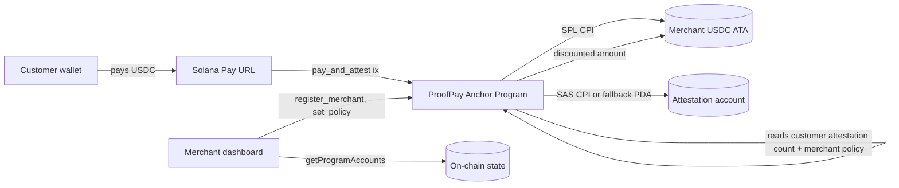

# MVP spec — ProofPay (Frontier 2026)

**Product:** Pay any Solana merchant in USDC, earn a portable on-chain attestation via the Solana Attestation Service, and get auto-applied discounts at the next merchant that trusts your history.

**Primary prize lane:** Grand Champion (see [prize-lane.md](./prize-lane.md)). Frontier 2026 has no tracks — single product-impact judging.

**Basis:** Winning wedge from [wedge-shortlist.md](./wedge-shortlist.md).

---

## User stories (MVP)

1. **As a merchant**, I connect my wallet, register my storefront on ProofPay, and define up to three portable-loyalty policy rules (e.g. "any customer with ≥ 3 attestations anywhere on Solana → 10% off"). Registration mints a `MerchantRegistry` PDA and links a USDC treasury ATA.
2. **As a customer**, I scan a merchant's Solana Pay QR, pay USDC from my wallet, and in the same transaction receive a cryptographic attestation issued by SAS (or the fallback Attestation PDA) that records `{merchant, amount, timestamp}`. My customer UI shows the merchant name, the discount applied (if any), and my running cross-merchant trust score.
3. **As a returning customer at a different merchant**, the checkout UI reads my attestation history in real time, matches it against the second merchant's policy rules, and auto-applies the best-matching discount before I sign. The second merchant sees my *portable* reputation, not a siloed loyalty token.

---

## On-chain scope (MVP)

**In scope**

- One Anchor program: `proof_pay`. Target ~600 LoC.
- **`MerchantRegistry` PDA** — seeded by `[b"merchant", merchant_pubkey]`. Stores `name: String`, `treasury_ata: Pubkey`, `policy: [PolicyRule; 3]`, `bump: u8`, `created_at: i64`.
- **`PolicyRule`** struct (inlined in registry) — `min_attestations: u8`, `discount_bps: u16`, `valid_until: i64`.
- **Instructions**
  - `register_merchant(name: String)` — creates `MerchantRegistry` PDA for the signer.
  - `set_policy(rules: Vec<PolicyRule>)` — merchant-only authority; stores up to three rules.
  - `pay_and_attest(amount_usdc: u64)` — atomic: SPL USDC transfer from customer ATA to merchant treasury ATA, then CPI to SAS (`sas_attest` with a `ProofPayAttestation` schema) *or* internal `Attestation` PDA fallback. Evaluates merchant policy vs. customer's total attestation count and applies discount by adjusting the transfer amount before the SPL CPI.
  - `close_merchant()` — optional cleanup; refunds rent to merchant.
- **SAS integration path**
  - Default: invoke the SAS program via CPI using the `sas-lib` schema and the merchant's `MerchantRegistry` as the authority/credential root.
  - Fallback: a `ProofPayAttestation` PDA under `proof_pay` itself, seeded by `[b"attestation", customer_pubkey, merchant_pubkey, tx_sig[..8]]`. Switch on Apr 28 if SAS CPI is blocking.
- **Schema (both paths):** `{ merchant: Pubkey, customer: Pubkey, amount: u64, timestamp: i64, tx_sig: [u8; 64] }`.
- **Testing:** LiteSVM harness with happy path + reject path (policy mismatch, insufficient balance, unauthorized `set_policy`). Minimum three tests before May 1 lock.

**Out of scope for MVP**

- Multiple tokens (USDC devnet / mainnet only).
- Fiat on/off-ramp (future Stripe/Circle integration).
- Mobile-native app (web responsive only).
- Merchant-to-merchant attestation revocation or dispute flows.
- Refund handling beyond what Solana Pay natively allows.
- Attestation expiry / rotation (use `valid_until` on the policy side instead).
- Gasless transactions / account abstraction (Phantom covers UX well enough for demo).
- Off-chain indexer beyond a simple `getProgramAccounts` filter and optional Helius webhook.

---

## Explicit non-goals

- Not a full KYC/compliance platform. Humanship ID integration is a v2 feature.
- Not a payment processor replacement — Solana Pay does the rail; ProofPay does the reputation layer.
- Not a multi-brand loyalty platform in the Web2 sense — ProofPay is the *absence* of a centralized loyalty database. That's the pitch.

---

## Demo script outline (≈ 2–3 minutes)

1. **Setup (15s):** README flash — "Clone, `pnpm i`, `anchor deploy --provider.cluster devnet`, `pnpm dev`. Live Vercel link available."
2. **Merchant A onboards (20s):** Connect Phantom → name "Café Solana" → set policy "≥ 3 attestations → 10% off". `MerchantRegistry` mints.
3. **Customer first purchase (30s):** Scan QR → pay 4.50 USDC → transaction inspector shows SPL transfer + SAS attestation mint in one sig. Customer UI: "Attestation #1 earned. Cross-merchant trust score: 1."
4. **Merchant B onboards (15s):** Second wallet → "Lunch Counter" → policy "≥ 3 attestations → 15% off".
5. **Customer second and third purchases (25s):** Two more purchases at Merchant A to reach attestation count 3.
6. **Third-merchant auto-discount (20s):** Customer goes to Merchant B for the first time. UI pre-checkout reads attestation count 3 → auto-applies 15% off → customer signs 8.50 USDC for a 10 USDC order. Receipt shows "Loyalty from *other merchants* on Solana."
7. **The narrative beat (15s):** Cut to Decal comparison: "Decal gives each merchant a siloed loyalty token. ProofPay gives *you* a portable reputation that every Solana merchant can choose to honor." Close on Szabo pullquote: *"Enforce the relationship in code."*
8. **Wrap (15s):** README + architecture diagram + "What's next" slide (Humanship integration, Stripe on-ramp, ProofPay SDK for merchants).

---

## Success checklist (submission week, by May 11)

- [ ] Fresh machine can complete happy path from README in under 15 minutes (clone → devnet deploy → pay → see discount).
- [ ] Demo video ≤ 3 minutes, rehearsed, uploaded, public link.
- [ ] Repo has architecture diagram (mermaid in README, exported PNG as backup).
- [ ] README names Decal, Humanship, Squads Grid, and Zebec explicitly and states the differentiation angle.
- [ ] Known limitations and v2 roadmap section (Humanship ZK, Stripe, mobile native).
- [ ] University eligibility box in [prize-lane.md](./prize-lane.md) is checked yes/no with evidence.
- [ ] At least one friendly merchant (creator / OSS project / Superteam chapter) has run through the demo flow on devnet by May 9.

---

## Architecture

---

## If you pivot off ProofPay

See the pivot triggers in [wedge-shortlist.md](./wedge-shortlist.md). The program structure (merchant registry + policy PDA + SAS CPI) is reusable for: DePIN service access, OSS bounty payouts, creator-collective membership rails. Keep the same program; change the *segment* in the README and the demo script.
